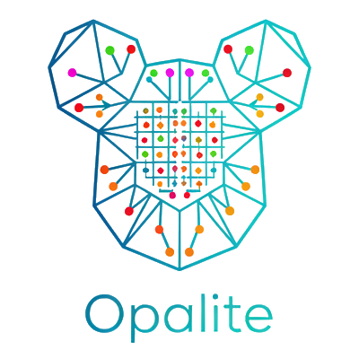

# Opalite - Toolkit for single-cell and spatial transcriptomics analysis and visualization

Opalite provides functions that implement specific workflows for single-cell and spatial transcriptomics analysis and visualization using existing packages such as [anndata][], [decoupler][], [scanpy][], [squidpy][], and [STalign][]

[anndata]: https://anndata.readthedocs.io
[decoupler]: https://decoupler.readthedocs.io
[scanpy]: https://scanpy.readthedocs.io
[squidpy]: https://squidpy.readthedocs.io
[STalign]: https://github.com/JEFworks-Lab/STalign

<div align="center">
  
</div>

## Installation

```
pip install --upgrade "git+https://github.com/kissdaniel/opalite.git"
```

## Examples

Coming soon...